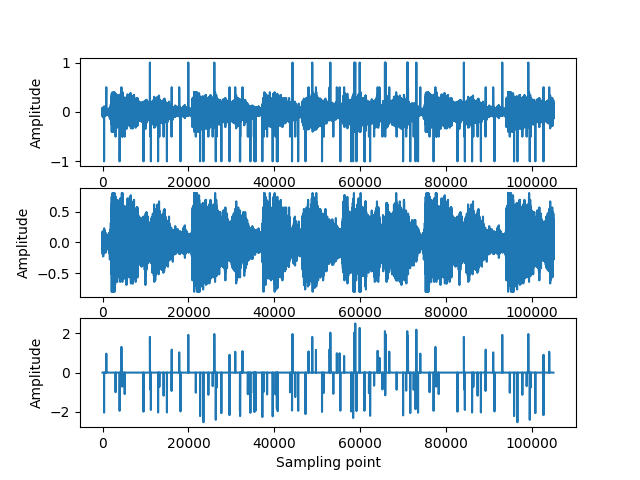
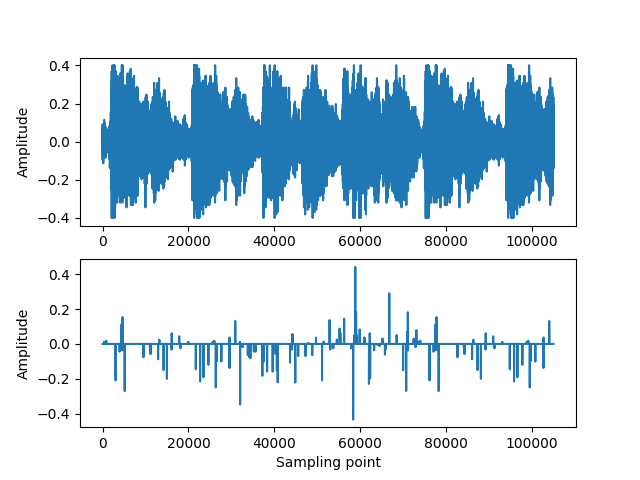
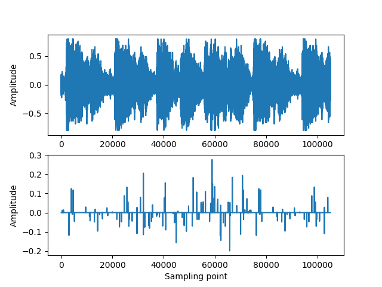
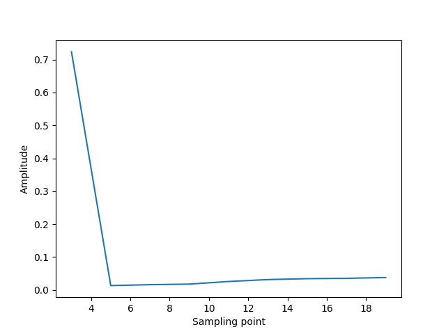

# Assignment 2: Audio Restoration using Python

## High-level Description of the project
This assignment builds on Assignment I. We assume that we have successfully detected the clicks and we are applying different interpolation methods to restore the audio, such as
- median filtering
- cubic splines

---

## Installation and Execution

Here shows the Python libraries and version in this assignment. To create the requirements I use the pipreqs to generate requirements.txt.
```sh                                 
matplotlib==3.8.2
numpy==1.26.2
playsound==1.3.0
scipy==1.11.4
tqdm==4.66.1
```
For more details check [here](https://github.com/bndr/pipreqs)


Afer installing all required packages you can run the demo file simply by typing:
```sh
python demo_audio_restoration.py
```
---

## Methodology and Results
Describe here how you have designed your code, e.g. a main script/routine that calls different functions, is the unittesting included in the main routine?

The first part of my code is the Median filter. First I use wavfile.read to extract sampling frequency and the array of audio's amplitude. Then I use the difference between degraded signal and restored signal and plot it to get a brief recognition about position and value of clicks. After creating the figure, I use threshold  = 0.1 to detect the clicks and get the number of clicks: 134, which is similar to the number in assignmnet 1. Thus I can make sure that I get all the clicks. All output figures in this part are shown below.



After creating the detection array  I can get the position of all the clicks. Then I use loop to interpolate them one by one. Since we just want the interpolation of certain point, so I just set a block of the number to reduce the Computational amount. In the median filter, I first pick up elments which is in length as filter and sort them from small to large. And then I choose the array of  median of those numbers as the output. Finally, I choose the median of the output array to be the interpolation. After restoring all clicks, I plot the restored signal and check difference between restored signal and clean signal.
The output figures are shown below.



Then we turn to the second part, which we need to use the Cubic Spline filter. Since python has CubicSpline to help develop the filter, I use this Cubic Spline to deal with the whole data array to restore all clicks at one time. Since the process is the same as what I have done during Median filter, I just put the output figure below to see the waves created through generating the restored signal.




In the Figure_5, the first part of this figure contains the orignal part signal with the label 'data' and the interpolated part signal with the label cubic spline

**Results**

1. For the median filter, different lengths were explored to test the effectiveness of the restoration. In particular, lengths changed from 3 to 19 with a duration 2 were tested and 5 was observed to deliver the lowest MSE, as shown in the figure below.



```sh
 filter  = 5
 MSE = 0.013569671723213213
```

The restored waveform <Mrestored.wav> with the optimal filter length is given below:

```sh
...\Python_Tutorial\Jiachengli_medianf\Mrestored.wav
```

2. Using the cubic splines, we observe that cubic splines will get lower MSE than the Median filter. What's more, compared with Median filter, it can detect all clicks at one time to interpolate them all.

The restored waveform <Csrestored.wav> with the optimal filter length is given below:

```sh
...\Python_Tutorial\Jiachengli_medianf\Csrestored.wav
```

3. Comparing the two different interpolation methods, we notice that method Cubic Spline achieves a lower MSE. The runtime of Median filter method is 0.18089489999692887 and the runtime of Cubic Spline filter method is 0.012999100028537214.

After listening to the two restored files, we notice both of these method can restore the audio very well.


---
## Credits

This code was developed for purely academic purposes by Computational-method-test (add github profile name) as part of the module Computational Method.


