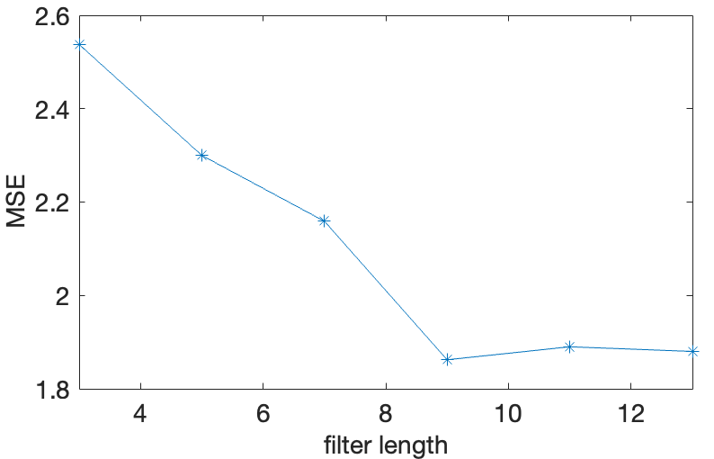

# Assignment 2: Audio Restoration using Python

## High-level Description of the project
This assignment builds on Assignment I. We assume that we have successfully detected the clicks and we are applying different interpolation methods to restore the audio, such as
- median filtering
- cubic splines

---

## Installation and Execution

Here shows the Python libraries and version in this assignment. To create the requirements I use the pipreqs to generate requirements.txt.
```sh                                 
matplotlib==3.8.2
numpy==1.26.2
scipy==1.11.4
tqdm==4.66.1
```
For more details check [here](https://github.com/bndr/pipreqs)


Afer installing all required packages you can run the demo file simply by typing:
```sh
python demo_audio_restoration.py
```
---

## Methodology and Results
Describe here how you have designed your code, e.g. a main script/routine that calls different functions, is the unittesting included in the main routine?

The first part of my code is the Median filter. First I use wavfile.read to extract sampling frequency and the array of audio's amplitude. Then I use the difference between degraded signal and restored signal and plot it to get a brief recognition about position and value of clicks. After creating the figure, I use threshold  = 0.1 to detect the clicks and get the number of clicks: 134, which is similar to the number in assignmnet 1. Thus I can make sure that I get all the clicks.


**Results**

1. For the median filter, different lengths were explored to test the effectiveness of the restoration. In particular, XXXX were tested and XXX was observed to deliver the lowest MSE, as shown in the figure below.



The restored waveform <output_medianFilter.wav> with the optimal filter length is given below:


2. Using the cubic splines, we observe ....

The restored waveform <output_cubicSplines.wav> with the optimal filter length is given below:


3. Comparing the two different interpolation methods, we notice that method X achieves a lower MSE. The runtime of XX method is .....

After listening to the two restored files, we notice ...


---
## Credits

This code was developed for purely academic purposes by XXXX (add github profile name) as part of the module ..... 

Resources:
- XXXX
- XXX


